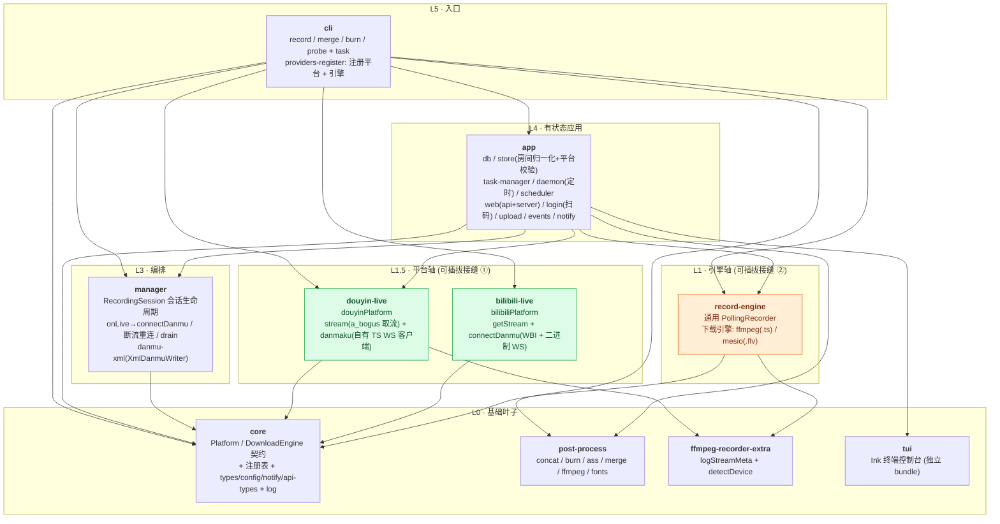
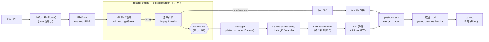

# 架构

pnpm workspace monorepo，11 个包，收敛成 **2 个可插拔接缝**：

- **平台轴**（`<平台>-live`）—— 平台专属的一切：取流（`getStream`）+ 弹幕（`connectDanmu`）+ 开播判定（`getLiving`）。接新平台 = 写一个 `<平台>-live` 实现 `Platform` 接口 + `registerPlatform` 一行。
- **引擎轴**（`record-engine`）—— 平台无关的下载：通用 `PollingRecorder` + 下载引擎策略（`ffmpeg` / `mesio`）。加新引擎 = 写一个 `DownloadEngine` 策略 + `registerEngine` 一行，所有平台立即可用。

依赖**只能向下**（`test/arch/layering.test.ts` 守护：每个包的 rank 必须严格大于它依赖的任何包；新增包须在 `RANKS` 登记）。esbuild 把 `cli` 打成自包含单文件 `dist/douyin-rec.mjs`（+ 独立的 `dist/tui.mjs`）。

> 同时维护一份等价的可交互图：[architecture.html](./architecture.html)。CLI / app 层细节见 [cli.md](./cli.md) · [app.md](./app.md)。

## 依赖分层图

箭头 = 「依赖」（A → B 表示 A 用 B）。层级越低越通用，只能被上层依赖。**绿色 = 平台轴**接缝、**橙色 = 引擎轴**接缝。

> `web/`（React19 + jotai + @base-ui/react + Tailwind v4）是**独立 Vite 工程**，构建产物 `packages/web/dist` 由 `app` 的 web server 托管，不参与上面的 `@drec/*` 依赖图。

## 运行时数据流（一次录制会话）

`app` 的 daemon 在定时窗口内 spawn 一个 `record` 子进程；`record-engine` 的 `PollingRecorder` 经注册表 `platformForRoom(url)` 拿到平台实例驱动取流，确认开播那一刻 fire `onLive`，`manager` 据此扇出弹幕。视频与弹幕分别落盘，事后由 `post-process` 合并/烧录、`upload` 投稿。

**两个接缝在数据流里的体现：**

- **平台轴**只回答「这个房间在播吗 / 流地址是什么 / 弹幕从哪连」——`getLiving` / `getStream` / `connectDanmu`。换平台不动录制逻辑。
- **引擎轴**只负责「把 `getStream` 给的 `url + headers` 下载到磁盘」——`ffmpeg`（`-c copy` → `.ts`）或 `mesio`（rust-srec `--fix` → `.flv`），并透传平台给的 headers（如 bilibili CDN 的 Referer/UA）。换引擎所有平台立即生效。
