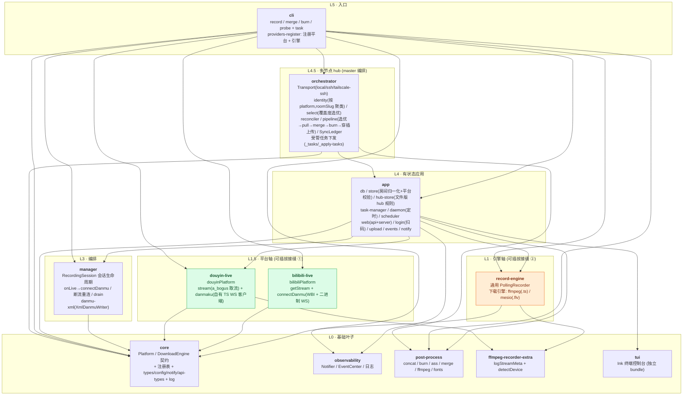
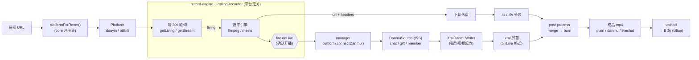
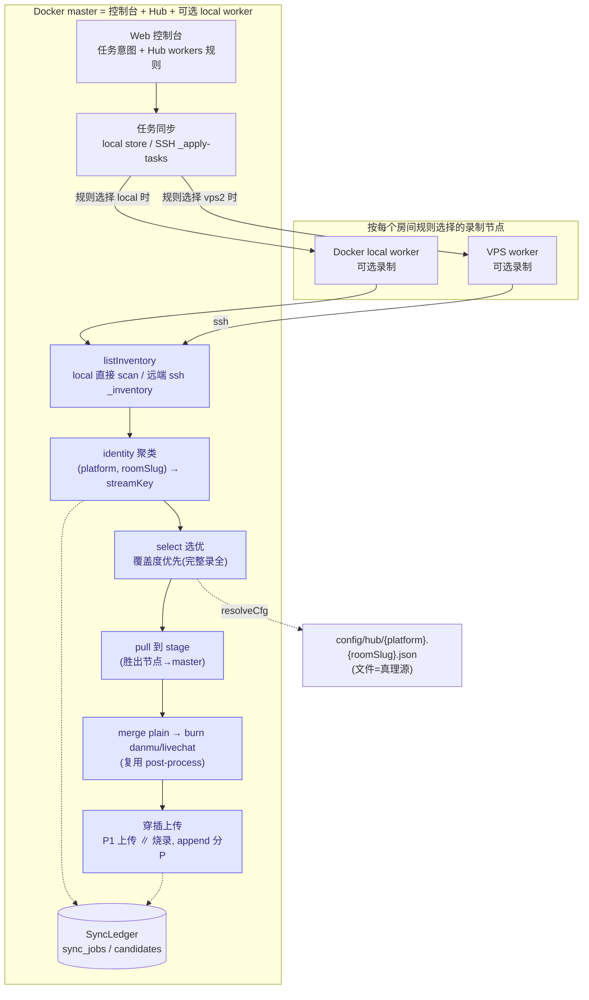

# 架构

pnpm workspace monorepo，13 个包，收敛成 **2 个可插拔接缝** + **1 个多节点编排层**：

- **平台轴**（`<平台>-live`）—— 平台专属的一切：取流（`getStream`）+ 弹幕（`connectDanmu`）+ 开播判定（`getLiving`）。接新平台 = 写一个 `<平台>-live` 实现 `Platform` 接口 + `registerPlatform` 一行。
- **引擎轴**（`record-engine`）—— 平台无关的下载：通用 `PollingRecorder` + 下载引擎策略（`ffmpeg` / `mesio`）。加新引擎 = 写一个 `DownloadEngine` 策略 + `registerEngine` 一行，所有平台立即可用。
- **多节点 hub**（`orchestrator`）—— Docker `task serve --hub` 同时提供控制台、master 编排和 `local` 录制 worker；录制落在哪个节点由每个房间的 Hub 规则选择。规则绑定 master 上的源任务（`recording.sourceTaskId`）并将启用状态同步给选中的 worker；选 VPS 且不选 `local` 时，master 仍保存任务配置与启停意图，但抑制该房间的本机录制。选中多个 worker 会产生多份录制副本。master 读取节点清单、按 `(platform, roomSlug)` 聚类、覆盖度选优、拉取胜出文件到本机，再执行合并/烧录/上传。VPS worker 运行普通 `task serve`，不运行 Hub。任务与 Hub 配置通过 Web 控制台维护。详见 [multi-node-sync.md](./multi-node-sync.md)。

依赖**只能向下**（`test/arch/layering.test.ts` 守护：每个包的 rank 必须严格大于它依赖的任何包；新增包须在 `RANKS` 登记）。esbuild 把 `cli` 打成自包含单文件 `dist/douyin-rec.mjs`（+ 独立的 `dist/tui.mjs`）。

> **热图(自动生成)**:[architecture.html](./architecture.html) —— 包热图(语义角色 + 变更热度)、运行流程图、依赖边。
> 它由 `scripts/gen-architecture.mjs` 从仓库真实数据(包依赖 / LOC / git 变更 / 分层表)生成,**不要手改**
> (会被下次生成覆盖)。改了架构后跑 `pnpm arch:gen` 重新生成;`pnpm arch:check` 校验是否与仓库一致。
> 本文(`architecture.md`)是**叙述性真相源**,`architecture.html` 是其可视化快照。CLI / app 层细节见 [cli.md](./cli.md) · [app.md](./app.md)。

## 依赖分层图

箭头 = 「依赖」（A → B 表示 A 用 B）。层级越低越通用，只能被上层依赖。**绿色 = 平台轴**接缝、**橙色 = 引擎轴**接缝。

```mermaid
flowchart TB
  subgraph L5["L5 · 入口"]
    cli["<b>cli</b><br/>record / merge / burn / probe + task<br/>providers-register: 注册平台 + 引擎"]
  end
  subgraph L45["L4.5 · 多节点 hub (master 编排)"]
    orch["<b>orchestrator</b><br/>Transport(local/ssh/tailscale-ssh)<br/>identity(按 platform,roomSlug 聚类) / select(覆盖度选优)<br/>reconciler / pipeline(选优→pull→merge→burn→穿插上传) / SyncLedger<br/>受管任务下发(_tasks/_apply-tasks)"]
  end
  subgraph L4["L4 · 有状态应用"]
    app["<b>app</b><br/>db / store(房间归一化+平台校验) / hub-store(文件版 hub 规则)<br/>task-manager / daemon(定时) / scheduler<br/>web(api+server) / login(扫码) / upload / events / notify"]
  end
  subgraph L3["L3 · 编排"]
    manager["<b>manager</b><br/>RecordingSession 会话生命周期<br/>onLive→connectDanmu / 断流重连 / drain<br/>danmu-xml(XmlDanmuWriter)"]
  end
  subgraph L15["L1.5 · 平台轴 (可插拔接缝 ①)"]
    douyin["<b>douyin-live</b><br/>douyinPlatform<br/>stream(a_bogus 取流) + danmaku(自有 TS WS 客户端)"]
    bilibili["<b>bilibili-live</b><br/>bilibiliPlatform<br/>getStream + connectDanmu(WBI + 二进制 WS)"]
  end
  subgraph L1["L1 · 引擎轴 (可插拔接缝 ②)"]
    engine["<b>record-engine</b><br/>通用 PollingRecorder<br/>下载引擎: ffmpeg(.ts) / mesio(.flv)"]
  end
  subgraph L0["L0 · 基础叶子"]
    core["<b>core</b><br/>Platform / DownloadEngine 契约<br/>+ 注册表 + types/config/notify/api-types + log"]
    observ["<b>observability</b><br/>Notifier / EventCenter / 日志"]
    post["<b>post-process</b><br/>concat / burn / ass / merge / ffmpeg / fonts"]
    extra["<b>ffmpeg-recorder-extra</b><br/>logStreamMeta + detectDevice"]
    tui["<b>tui</b><br/>Ink 终端控制台 (独立 bundle)"]
  end

  cli --> orch
  orch --> app
  orch --> post
  orch --> core
  cli --> app
  cli --> observ
  cli --> manager
  cli --> douyin
  cli --> bilibili
  cli --> engine
  cli --> post
  cli --> core
  app --> manager
  app --> observ
  app --> douyin
  app --> engine
  app --> post
  app --> tui
  app --> core
  manager --> core
  douyin --> core
  douyin --> extra
  bilibili --> core
  engine --> core
  engine --> extra

  classDef axisPlat fill:#dcfce7,stroke:#16a34a,color:#14532d;
  classDef axisEng fill:#ffedd5,stroke:#ea580c,color:#7c2d12;
  class douyin,bilibili axisPlat;
  class engine axisEng;
```

> `web/`（React19 + jotai + @base-ui/react + Tailwind v4）是**独立 Vite 工程**，构建产物 `packages/web/dist` 由 `app` 的 web server 托管，不参与上面的 `@drec/*` 依赖图。

## 运行时数据流（一次录制会话）

`app` 的 daemon 在定时窗口内 spawn 一个 `record` 子进程；`record-engine` 的 `PollingRecorder` 经注册表 `platformForRoom(url)` 拿到平台实例驱动取流，确认开播那一刻 fire `onLive`，`manager` 据此扇出弹幕。视频与弹幕分别落盘，事后由 `post-process` 合并/烧录、`upload` 投稿。

```mermaid
flowchart LR
  url["房间 URL"] --> pf["platformForRoom()<br/>(core 注册表)"]
  pf --> plat["Platform<br/>douyin / bilibili"]

  subgraph eng["record-engine · PollingRecorder (平台无关)"]
    poll["每 30s 轮询<br/>getLiving / getStream"]
    poll -->|living| spawn["选中引擎<br/>ffmpeg / mesio"]
    spawn --> onlive{{"fire onLive<br/>(确认开播)"}}
  end
  plat --> poll

  spawn -->|"url + headers"| dl["下载落盘"]
  dl --> ts[".ts / .flv 分段"]

  onlive --> dm["manager<br/>platform.connectDanmu()"]
  dm --> ws["DanmuSource (WS)<br/>chat / gift / member"]
  ws --> xw["XmlDanmuWriter<br/>(锚到视频起点)"]
  xw --> xml[".xml 弹幕<br/>(biliLive 格式)"]

  ts --> pp["post-process<br/>merge → burn"]
  xml --> pp
  pp --> mp4["成品 mp4<br/>plain / danmu / livechat"]
  mp4 --> up["upload<br/>→ B 站 (biliup)"]
```

**两个接缝在数据流里的体现：**

- **平台轴**只回答「这个房间在播吗 / 流地址是什么 / 弹幕从哪连」——`getLiving` / `getStream` / `connectDanmu`。换平台不动录制逻辑。
- **引擎轴**只负责「把 `getStream` 给的 `url + headers` 下载到磁盘」——`ffmpeg`（`-c copy` → `.ts`）或 `mesio`（rust-srec `--fix` → `.flv`），并透传平台给的 headers（如 bilibili CDN 的 Referer/UA）。换引擎所有平台立即生效。

## 多节点 hub 数据流（节点录制 → master 后处理）

**角色由运行进程决定，不代表机器只能承担一种角色。** Docker 运行 `task serve --hub`，既是 master 控制器，也是 `local` worker；它可以录制分配给本机的房间。VPS 运行普通 `task serve`，作为远端 worker，由 master 同步任务并读取录制清单。每个房间的 Hub 规则 `workers` 决定实际录制节点：

- `["local"]`：仅 Docker 本机录制。
- `["vps2"]`：仅 VPS 录制；master 上的源任务是控制台中的配置与启停意图，本地 daemon 不会启动该房间的录制进程。
- `["local", "vps2"]`：两个节点都会录制，形成冗余副本，收播后由 master 选优。

启用源任务代表“该房间需要录制”，不单独指定本地录制。通过控制台启动或停用源任务，Hub 会把 enabled 状态同步给规则选中的 worker。Hub 页负责绑定源任务和选择节点；任务页负责房间任务及启停。远端受管任务标记为 `managedBy='hub'`，只能在 master 控制台操作。

实际流程是：master 下发任务期望 → 被选 worker 各自录制 → master 扫描节点清单并等待录制结束 → 按覆盖度选优 → 从胜出节点拉取到 master 的 `stage/` → 合并/烧录/上传。master 是后处理和上传的控制点；VPS 不运行 Hub，也不负责这条后处理管线。master 任务页同时显示所选 worker 的实时录制状态，约每 5 秒刷新一次；不会把本机任务进程状态误当成远端状态。

```mermaid
flowchart TB
  subgraph nodes["按每个房间规则选择的录制节点"]
    dk["Docker local worker<br/>可选录制"]
    vps["VPS worker<br/>可选录制"]
  end
  subgraph master["Docker master = 控制台 + Hub + 可选 local worker"]
    intent["Web 控制台<br/>任务意图 + Hub workers 规则"]
    sync["任务同步<br/>local store / SSH _apply-tasks"]
    inv["listInventory<br/>local 直接 scan / 远端 ssh _inventory"]
    cluster["identity 聚类<br/>(platform, roomSlug) → streamKey"]
    sel["select 选优<br/>覆盖度优先(完整录全)"]
    pull["pull 到 stage<br/>(胜出节点→master)"]
    merge["merge plain → burn danmu/livechat<br/>(复用 post-process)"]
    up["穿插上传<br/>P1 上传 ∥ 烧录, append 分P"]
    led[("SyncLedger<br/>sync_jobs / candidates")]
  end
  intent --> sync
  sync -->|"规则选择 local 时"| dk
  sync -->|"规则选择 vps2 时"| vps
  dk --> inv
  vps -->|ssh| inv
  inv --> cluster --> sel --> pull --> merge --> up
  sel -. resolveCfg .-> rule["config/hub/{platform}.{roomSlug}.json<br/>(文件=真理源)"]
  cluster -.-> led
  up -.-> led

  classDef hub fill:#e0e7ff,stroke:#4f46e5,color:#312e81;
  class inv,cluster,sel,pull,merge,up hub;
```

- **触发**：master 本机录制产生的 `recordEnd` 可即时触发；远端收播事件不会作为本地 `recordEnd` 直接转发，远端录制场景由周期 `reconcileAll` 扫描发现。pipeline 会等待 settle，并跳过仍在录制的场。
- **选优**：完整录全（单会话无断流）优先；**所有节点都断流 → 中断 + 通知 + 不删源**。
- **配置与操作**：每房间一份 `config/hub/{platform}.{roomSlug}.json`（`upload.mode`=stage|upload + `private`），由 Web 控制台 Hub 页维护；录制任务在任务页管理。规则文件是配置真源，API 现读，控制台变更会反映到同步与调度。
- **录制范围**：只有规则选中的节点会参与该房间录制与选优；Docker 运行 Hub 不会默认使它再录一份。选择 `local` 与远端 worker 才是显式双录。关水印/仅自己可见/copyright 是 `biliup.ts` 代码常量（不可配）。
