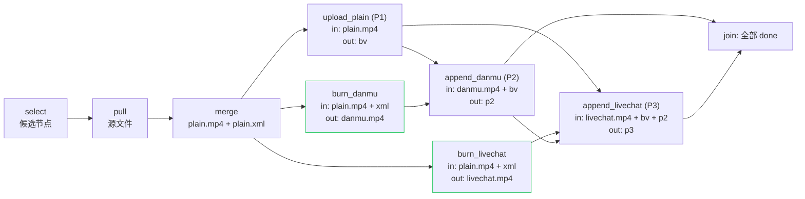
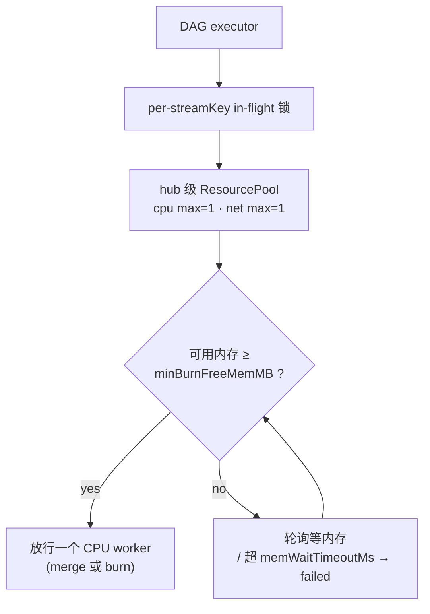

# 023 — Workflow 安全阀、单节点重跑与 OOM 防护

## 现状

当前 pipeline 已拆成并行轨：

- `merge` 产出 plain；
- `burn_danmu` / `burn_livechat` 并行；
- `upload_plain`（P1）后台先传，拿 BV；
- `append_danmu` / `append_livechat` 各自串在烧录轨后面，且 livechat append 等 danmu append 完成后才走，保持 B 站 P2/P3 顺序。

缺口：

- 没有统一的节点输入/输出契约，缺文件、0 字节产物只能靠“命令退出码”发现；
- 任一条轨抛错会让整场 job 标 `failed`，reconciler 只能整场重跑，已完成的节点没有 checkpoint；
- UI 只区分 `done/active/skipped/todo`，节点失败不能单独显示，也不能单独点重跑；
- 两个 ffmpeg burn 同时起，存在 OOM 风险。

## 目标

1. 每个 workflow 节点声明 `inputs` / `outputs`，执行前后都做安全阀校验。
2. 上传拆成两个明确节点：`append_danmu(P2)`、`append_livechat(P3)`，各自有输入输出安全阀。
3. 节点失败只影响下游依赖，不再把整个 job 卡死；UI 上可以点单个失败节点重跑。
4. 结构图保持 `danmu` / `livechat` 并行（DAG 层面不互相等待）；**资源池同时只放行一个 CPU 密集 worker**，天然不会有两个 ffmpeg filtergraph 同跑。

> 命名决定：内部节点 key 沿用现有 ledger `append_danmu` / `append_livechat`（旧库 `sync_job_steps`、`resumeAppends`/`isStepDone`、flow-build、`ALL_STEP_KEYS` 都已用这组 key）。UI 显示名改为“上传 P2 / 上传 P3”，不做破坏性重命名。

## 目标结构



说明：

- `burn_danmu` / `burn_livechat` 都只需要等 `merge`（plain），**不互相等**；livechat 不需要等 danmu 烧录完成。DAG 并行不等于物理并行，CPU 资源池会把 burn 串成一次一个。
- `append_livechat` 才需要等 `append_danmu`，这是为了保持 B 站分 P 顺序（P1 plain → P2 danmu → P3 livechat），不是烧录阶段串行。
- 所有核心节点都可单独失败/重跑；上游未满足时下游显示 `blocked`，不会误跑。
- 禁用步骤（如 `burnDanmu=false`）→ 该轨节点标 `skipped` 并**放行下游**：`append_danmu` 为 skipped 时，`append_livechat` 只等 `bv` + livechat burn，不会永久 blocked。

## 节点契约与安全阀

统一节点模型：

```ts
interface WorkflowNode {
  key: NodeKey;             // merge / burn_danmu / burn_livechat / upload_plain / append_danmu / append_livechat
  inputs: ArtifactSpec[];
  outputs: ArtifactSpec[];
  resource: "cpu" | "net" | "none";
  run(ctx: NodeRunContext): Promise<void>;
}

interface ArtifactSpec {
  name: string;       // plain.mp4 / bv / p2 等
  kind: "file" | "ref";
  required: boolean;
  minBytes?: number;  // 文件型默认 1，0 字节视为失败
}
```

`select` / `pull` 维持现有逻辑，不进节点表；`merge` 的 input 安全阀会兜底拉取结果。`stage` 模式下
`upload_plain` / `append_*` 直接标 `skipped`，DAG 在两条烧录完成后收口 `needs_manual`（沿用现状）。

实际节点：

| 节点 | inputs | outputs | resource |
| --- | --- | --- | --- |
| `merge` | 源 `.ts` + `.xml`(可选) | `plain.mp4` + `plain.xml`(可选) | cpu |
| `burn_danmu` | `plain.mp4` + `plain.xml`(可选) | `danmu.mp4` | cpu |
| `burn_livechat` | `plain.mp4` + `plain.xml`(可选) | `livechat.mp4` | cpu |
| `upload_plain` | `plain.mp4` | `bv`(ref) | net |
| `append_danmu` | `danmu.mp4` + `bv` | `p2`(ref) | net |
| `append_livechat` | `livechat.mp4` + `bv` + `p2` | `p3`(ref) | net |

安全阀规则：

- 执行前校验所有 required input；缺失 / 0 字节 → 节点直接 `failed`，不跑命令。
- 执行后校验所有 output；缺失 / 0 字节 → 节点 `failed`，错误信息写明“输出为空”。
- 被 `skipped` 的上游节点，其 output ref 视为已满足：如 `burnDanmu=false` 时，`append_livechat` 只等
  `livechat.mp4 + bv`，不会因为缺 `p2` 永久 `blocked`。
- `failed` 节点记录错误 + attempt 数；job 不整体回滚，兄弟独立节点继续跑。
- **可重跑集合** = `merge` 及其下游核心节点；`select`/`pull` 是 pipeline 前奏，不在 UI 单节点重跑范围；`clean_*` 是收尾节点，不做单节点重跑。
- **上传类节点不自动重跑**：`upload_plain` / `append_*` 失败后，reconciler 不自动 resume，直接收口 `needs_manual`（biliup 无幂等，可能已建稿 / 已加分 P），只允许 UI 手动重跑 + 确认。
- reconciler 判定以节点为准：job `failed` 时先看 `sync_node_states`，失败节点全部属于
  `merge` / `burn_*` 且 `fails < maxRetries` → 重新进 pipeline（幂等跳过 done）；只要含
  `upload_plain` / `append_*` 失败 → 直接 `needs_manual`，不消耗也不等待重试预算，避免“进 pipeline 后又把上传节点自动跑一遍”。

## 节点状态与持久化

新增节点状态表（只读端 `hub-jobs.ts` 同步读取）：

```sql
CREATE TABLE IF NOT EXISTS sync_node_states(
  streamKey TEXT NOT NULL,
  node TEXT NOT NULL,             -- 与 StepName 同 key
  state TEXT NOT NULL,            -- pending / running / done / failed / blocked / skipped
  error TEXT,
  attempts INTEGER NOT NULL DEFAULT 0,
  updatedAt INTEGER NOT NULL,
  PRIMARY KEY(streamKey, node)
);
```

job 状态机增加 `retrying`（非终态）：UI 显示重跑中的节点，reconciler 不会并发重入；重跑全部成功后再走 `done`，重跑仍失败则回到 `failed`。

幂等续跑（**替换现在的 bv 特例 `resumeAppends`**）：

- `runPipeline` 每次进入先读 `sync_node_states`，`done` 节点直接跳过，只跑 `pending/failed` 节点及其未完成下游。
- `upload_plain` 成功后照旧立即 `setBv` checkpoint；有 bv 时自动路径绝不重传 P1。
- 节点失败后不立即中断兄弟轨；DAG executor 等所有在飞节点 settle 后再收口 job 状态，UI 才能同时看到“某轨 failed、某轨 done”。

旧 run 回填：

- 启动时（或首次 `retryNode` 前）对没有 `sync_node_states` 的 job，按 `sync_job_steps` 最新事件回填：
  done → `done`，只有 start 没有 done → `failed`（错误“上次中断/失败”）；bv 已落库 → `upload_plain` 回填 `done`。
- 回填后统一跑 stale sweep。否则升级前已失败的 job（例如本次 livechat burn 失败）在 UI 上仍然没有单节点重跑入口。

崩溃恢复：

- 启动时 sweep：`retrying` job 或 `running` 节点超过 `staleMs`（默认 10 分钟）→ 标 `failed` + 错误“进程重启中断”，避免 reconciler 永久跳过、节点永久挂起。

## 并发守卫与资源池（OOM 防护）



结论：

- **资源池在 `hubStarter.start` 创建一次**，reconciler 的 `pipelineDeps` 与 `retryNode` 共用同一实例，杜绝“UI 重跑一个 burn 的同时，周期对账又起另一个 burn”。
- `cpu max=1` 同时覆盖 `merge` 与两个 `burn`：用户要求一次一个 burn worker；merge 也走同一把锁，防止 retry 并发时 merge 与 burn 重叠。
- `net max=1` 覆盖 P1 上传与两个 append：天然避免同稿件并发 append。
- per-streamKey in-flight 锁：reconciler 与 `retry-node` 共用，同一场绝不同时跑两个执行体。
- 内存闸门：读 `/proc/meminfo` 的 `MemAvailable`（Linux），回落 `os.freemem()`；低于 `minBurnFreeMemMB` 时轮询等待，超过 `memWaitTimeoutMs` 才标节点 `failed`——**不无限悬挂**。
- 默认值：`maxCpuParallel=1`、`minBurnFreeMemMB=2048`、`memWaitTimeoutMs=600000`（均可在 hub.config.json 配置）。

## 单节点重跑

后端：

- 新增 `POST /api/hub/jobs/:streamKey/retry-node`，body `{ node: "burn_livechat", force?: boolean }`。
- CLI `hubStarter` 增加 `retryNode(streamKey, node)`；实现复用 orchestrator 的节点执行器，只跑该节点 + 后续未完成依赖，`done` 节点跳过。
- 重跑期间 job → `retrying`；成功后若全部节点完成 → `markDone` + `uploadDone` 通知；失败 → 节点 `failed`，job `failed`，保留其他节点 checkpoint。
- **多段 append（>1 段）后端默认拒绝**（`force !== true` 返回 400），因为 biliup 无幂等、可能已部分加分 P；`upload_plain` 同理（可能已建稿），手动重跑前先核对 B 站。
- `upload_plain` 重跑前若已有任一 `append_*` 为 `done`，后端直接拒绝（409）：P2/P3 已挂旧 BV，重传会建重复稿，必须人工核对/删稿后再决定。正常失败时序下 append 不会先于 P1 done，此防护主要挡手动乱点。
- 手动重跑不消耗 reconciler 自动重试的 `fails` 预算（语义上分开：`attempts` 是节点执行次数，`fails` 是整场自动重试次数）。

UI：

- `StepNode` 增加 `failed` / `blocked` 状态样式；
- 失败节点出现重跑按钮（`RotateCcw`），点击调用 API；
- 重跑期间节点显示 spinner，轮询自动刷新；
- 多段 `append_*` / `upload_plain` 重跑前弹确认框（biliup 无幂等，先核对分 P/稿件）。

## UI / flow-build 升级

- `buildFlow` 从“lane 链”升级为**显式 DAG 布局**：`append_danmu` 有两个父节点（`upload_plain` + `burn_danmu`），`append_livechat` 有三个（`upload_plain` + `burn_livechat` + `append_danmu`），现有 lane 模型表达不了多父边。
- `HubJobDTO` 增加 `nodeStates`（key/state/error/attempts/updatedAt）；`hub-jobs.ts` 读 `sync_node_states` 并随列表返回。
- `pipelineSig` 纳入 node states，失败/重跑状态变化时强制重渲染。
- 旧 run 没有 `sync_node_states` → UI 回落现有 step events 推导（向后兼容）。
- `retrying` 状态补齐 UI label、`TERMINAL`、ETA fallback 常量。

## 配置

- hub.config.json 新增 `resources: { maxCpuParallel?, minBurnFreeMemMB?, memWaitTimeoutMs?, staleMs? }`，全局生效（v1 不做 per-rule，减少 UI 表单改动）。
- `cli.ts` 的 `hubCfg` 类型与 `pipelineDeps.cfg` 透传；如后续要 per-rule，再扩 `HubPipelineConfig` + HubRuleDialog。

## 实施顺序

1. orchestrator：节点契约 + DAG executor + 资源池（cpu/net semaphore）+ per-streamKey in-flight 锁。
2. ledger：`sync_node_states` + `retrying` 状态 + 启动 stale sweep。
3. pipeline：改造成节点执行器 + 幂等续跑（替换 `resumeAppends` 特例）；burn/merge 走 cpu 池。
4. reconciler：`RETRYABLE` 不含 `retrying`；自动 resume 只重跑安全节点（burn/merge），上传失败收口 `needs_manual`。
5. CLI hubStarter：共享资源池 + `retryNode`。
6. Web API/client：`retry-node` 端点。
7. UI：DAG 布局 + node states + 失败/阻塞样式 + 重跑按钮 + i18n。
8. 测试：节点安全阀、单 CPU worker 资源池、节点失败不阻塞兄弟节点、幂等续跑、上传失败不自动重跑、stale 恢复、内存超时、UI 多父 DAG；并**更新现有“两条 burn 同时发出”断言**为“两条轨就绪，第二条等第一条完成后才发命令”。
